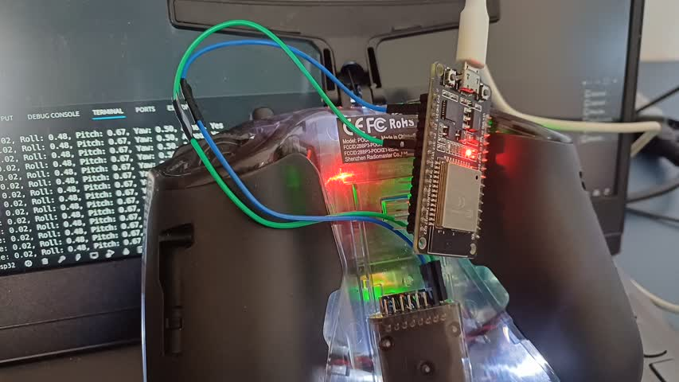

# ESP32 Radiomaster Pocket  

Connect Ground to Ground and Signal (First pin right to left on the Pocket) to RX2 (Pin16 on the Esp32)  
Use PlatformIO on VSCode to Build and Upload.  Should work without any extra configuration.  

The code is currently set up so you have to calibrate all channels everytime you boot the Esp32, but it's more of an example code than anything practical.  

  
  
